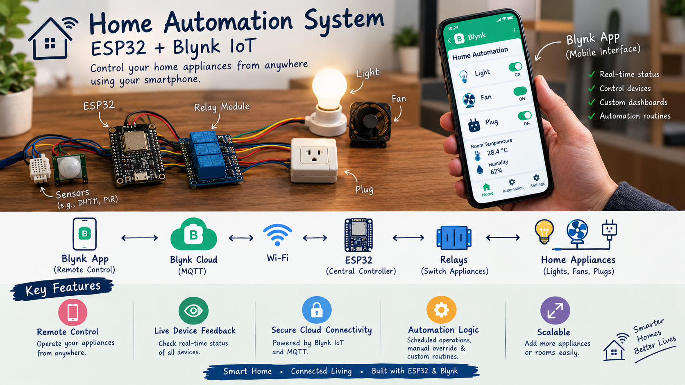

# Home Automation System Using ESP32 + Blynk IoT

<div align="center">
  
</div>

<p align="center">
  <a href="#overview"></a>
  <a href="#features"></a>
  <a href="#getting-started"></a>
</p>

A smart home automation project that allows users to control household appliances remotely using a mobile app. This project connects an ESP32 microcontroller to relays and uses the Blynk IoT platform for wireless control and monitoring.

## Overview

This system is designed to automate common home devices such as lights, fans, and power plugs. The ESP32 acts as the central controller, while Blynk provides a user-friendly interface for remote ON/OFF control through a smartphone.

The project is ideal for learning IoT, embedded systems, home automation, and relay-based control logic.

## System Architecture


## Features

- Remote control of appliances using a smartphone
- Wi-Fi-based connectivity with ESP32
- Blynk IoT integration for mobile automation
- Simple relay-based switching system
- Easy to expand with more appliances and sensors
- Suitable as a learning and prototype project

## Hardware Components

- ESP32 microcontroller
- Relay module
- Household appliances such as lights, fans, and plugs
- Wi-Fi router / internet connectivity
- Blynk mobile application

## Project Gallery

<div align="center">
  
  
</div>

## Repository Structure

```text
Home-automation-using-ESP32/
├── README.md
├── HomeAutomation.png
├── ON state.jpeg
├── OFF state.jpeg
├── DOC-20250514-WA0005..pdf
├── HA ppt final for pdf.pdf
├── firmware/
│   ├── README.md
│   └── sketch_apr30a.ino
├── docs/
│   └── README.md
├── sketch_apr30a/
│   └── sketch_apr30a.ino
└── .gitignore
```

## Getting Started

### Prerequisites

- Arduino IDE
- ESP32 board support package installed
- Blynk app installed on your device
- Wi-Fi network credentials
- Relay module and basic wiring accessories

### Steps

1. Open the firmware file in `firmware/sketch_apr30a.ino`.
2. Replace the Wi-Fi SSID and password with your own network details.
3. Add the correct Blynk authentication token.
4. Connect the ESP32 to the relay circuit and appliances.
5. Upload the code to the ESP32 board.
6. Open the Blynk app and control the devices.

## Configuration Example

Update the following values before uploading:

```cpp
char ssid[] = "your_wifi_name";
char pass[] = "your_wifi_password";
#define BLYNK_AUTH_TOKEN "your_auth_token"
```

Also ensure the relay pin assignments match your actual hardware wiring.

## Important Notes

- Verify the correct GPIO pins before deployment.
- Use a stable power source for the relay board and ESP32.
- This project is intended for educational and prototype use.
- For real-world deployment, add fuse protection, isolation, and safety checks.

## Documentation

Reference documents and project files are included in the repository:

- `DOC-20250514-WA0005..pdf`
- `HA ppt final for pdf.pdf`

## Future Enhancements

This system can be expanded with:

- Multiple relay channels
- Motion and temperature sensors
- Scheduled automation
- Energy monitoring
- Notifications and alerts
- Web dashboard support

## License

This project is intended for academic, educational, and personal use. Please give proper credit if you reuse or adapt the design.

---

<p align="center">
  <strong>Built for smart-home learning, IoT experimentation, and embedded systems exploration.</strong>
</p>

